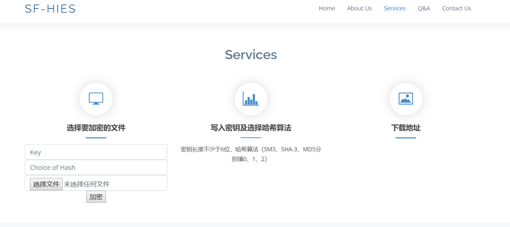

```
🕙 分享是一种美德，右上随手点个 🌟 Star，谢谢
```
 
**温馨提醒**
 
1. 本项目仅适用学习交流
2. 本项目不在任何平台出售,如有发现请积极举报<br/>

## 1 项目介绍
 
**基于多种hash算法的较小文件高强度加密方案设计与实现**
 
### 1.1 设计方案
 
本工程设计的主要方案如下：<br/>
（1）设计基于改进Feistel结构的加密方案。基于Feistel结构的分组密码结构简单，具有对称性，软硬件较易实现，但存在算法混淆和扩散速度较慢的问题。本工程任务计划对传统的Feistel结构进行了改进，使用ARX结构替代传统的S盒、P盒，提高了混淆和扩散效率，同时加快计算速率，更适合较小文件的加密运算。<br/>
（2）将成熟的Hash算法运用于Feistel结构中。本工程任务计划支持SM3、MD5、SHA-3常见Hash算法的调用，通过调用成熟的hash算法实现非线性变换功能，更进一步地保证了算法的安全性和高效性。<br/>
（3）采用改进的子密钥生成算法。本工程任务采取的改进方案是：首先将明文与密钥进行异或，然后根据分组结果或者哈希表查找比较次数，结合仿射变换决定子密钥的使用顺序，最后利用RSA加密子密钥的使用顺序。以增强算法抵抗暴力分析的能力。<br/>

### 1.2 功能介绍
（1）最快最短进行加密——缩短小型文件加密时间，保证小型文件加密效率<br/>
（2）增强加密算法复杂度及机密性——保证小型文件传输及存储安全性<br/>
（3）增强生成杂凑值的抗碰撞性及随机性——融入多种hash算法，国密SM3支撑加密强度<br/>
（4）防篡改防假冒——验证小型加密文件的完整性真实性<br/>
### 1.3 安装步骤
（1）安装依赖包
```
 pip install -r requirements.txt
```
 （2）启动项目
 ```
 python main.py
```
（3）打开前端界面 <br/>
访问http://127.0.0.1:5000/<br/>

如图：
 

 
### 1.4 使用方法
（1）在前端界面导航栏点击services，导航到文件加密界面<br/>
如图：

（2）输入不少于6位的密钥，并选择哈希算法，选择需要加密的文件，点击加密，即可在下载地址找到下载已加密文件的url，将url复制到浏览器即可下载
